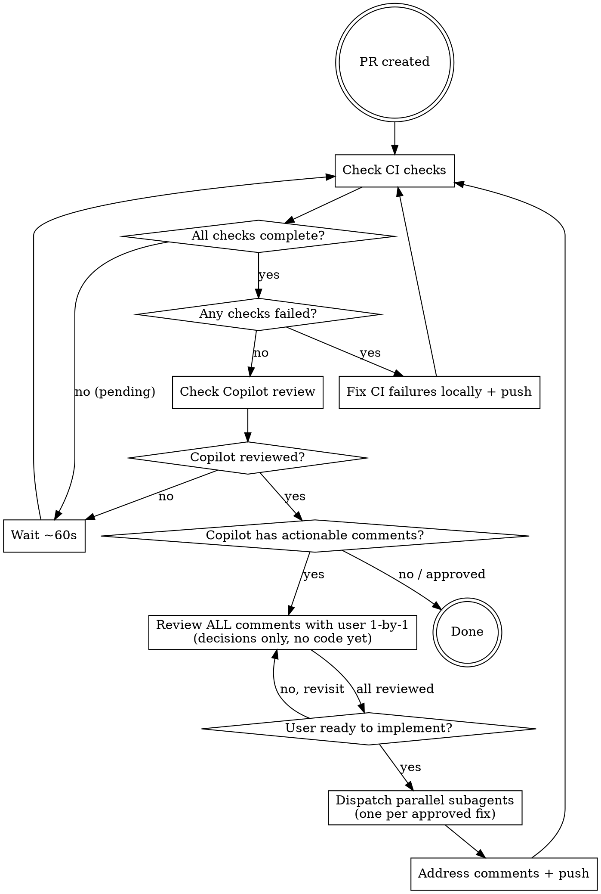

# Post-PR Monitoring

## Overview

Creating a PR is not the end. CI must pass and GitHub Copilot (when enabled) will automatically review the code within a few minutes. Do not hand off until both complete and any issues are resolved.

## The Loop



## Commands

### Check CI status
```bash
gh pr checks <pr-number>
```
Re-run until no check shows `pending` or `in_progress`. A `✓` on every row means passing.

### Get failed check logs
```bash
gh run list --branch <branch> --limit 5
gh run view <run-id> --log-failed
```

### Check for Copilot review
```bash
gh pr view <pr-number> --json reviews --jq '.reviews[] | select(.author.login == "github-copilot[bot]") | {state, body}'
```

### View Copilot inline comments
```bash
gh api repos/{owner}/{repo}/pulls/{pr-number}/comments \
  --jq '.[] | select(.user.login == "github-copilot[bot]") | {path: .path, line: .line, body: .body}'
```

## Fixing CI Failures

1. Identify the failing check from `gh pr checks`
2. Fetch logs: `gh run view <run-id> --log-failed`
3. Reproduce locally before guessing:
   - Lint: `pnpm lint`
   - Types: `pnpm typecheck`
   - Tests: `pnpm test`
4. Fix, commit, push — CI re-runs automatically on push

**Never force-push to a PR branch.** Push a new commit so the PR history stays intact.

## Addressing Copilot Comments

**Never silently fix Copilot comments on your own.** Walk through every comment with the user first — no code changes until all comments have been reviewed and decisions recorded.

### Phase 1: Review (decisions only — no code)

**Before presenting comments, group similar ones.** If multiple comments flag the same issue (e.g. three instances of "remove border from callout") or the same root cause, present them as a single batched item — one decision covers all of them. Don't make the user answer the same question three times.

For each comment (or batch of similar comments):

1. **Present it to the user** — show the file, line, and the full comment text
2. **Explain what Copilot is asking for** in plain language — what the concern is and why it might matter
3. **Give your read** — is this a valid concern, a false positive, or a style preference?
4. **Wait for the user's decision**: fix or skip
5. **Record the decision** and move to the next comment
6. Only move to the next comment once the user confirms they're ready

Do not touch any code during Phase 1. One comment, one conversation, one decision at a time.

### Phase 2: Implementation (after all comments reviewed)

Once every comment has a decision, ask: **"Ready to implement all the fixes?"**

- If yes → dispatch **parallel subagents** (one per approved fix) so all changes land in a single push
- If the user wants to revisit any comment → go back to Phase 1 for that comment

**Why parallel subagents:** Independent fixes on different lines/files can be implemented concurrently without conflicts, and a single push keeps CI clean.

### Phase 3: Reply to comments

After pushing the fixes, **reply to every Copilot comment on the PR** to close the loop:

- **Fixed comments** → reply with the commit SHA and a one-line summary of what changed
- **Skipped comments** → reply with "Acknowledged — [brief reason for skipping]"

```bash
# Reply to a PR review comment
gh api repos/{owner}/{repo}/pulls/comments/{comment_id}/replies \
  -X POST -f body="Fixed in {sha} — {what changed}"

# Get comment IDs
gh api repos/{owner}/{repo}/pulls/{pr-number}/comments \
  --jq '.[] | {id: .id, user: .user.login, path: .path}'
```

Post all replies in parallel (background `&` + `wait`) so it's fast.

## Timing

| What | Typical wait |
|------|-------------|
| CI checks start | ~30s after push |
| CI checks complete | 2–10 min depending on suite |
| Copilot review appears | 2–5 min after PR creation |
| Copilot timeout (give up) | 10 min |

If Copilot has not reviewed after 10 minutes, proceed — the review may be disabled or delayed. Note it to the user.

## Done When

- ✅ All CI checks show green (`gh pr checks` — no failures)
- ✅ GitHub Copilot has reviewed OR 10 minutes have elapsed with no review
- ✅ All Copilot actionable comments addressed (or explicitly noted as false positives)
