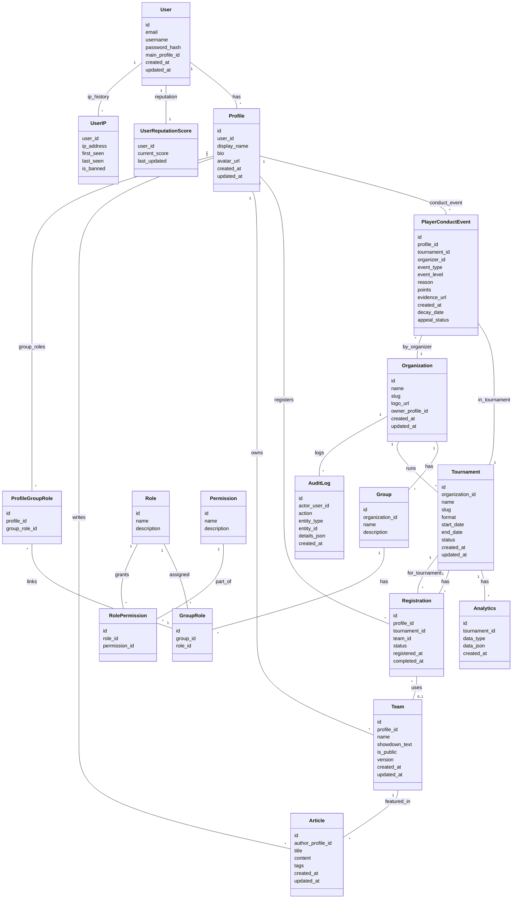
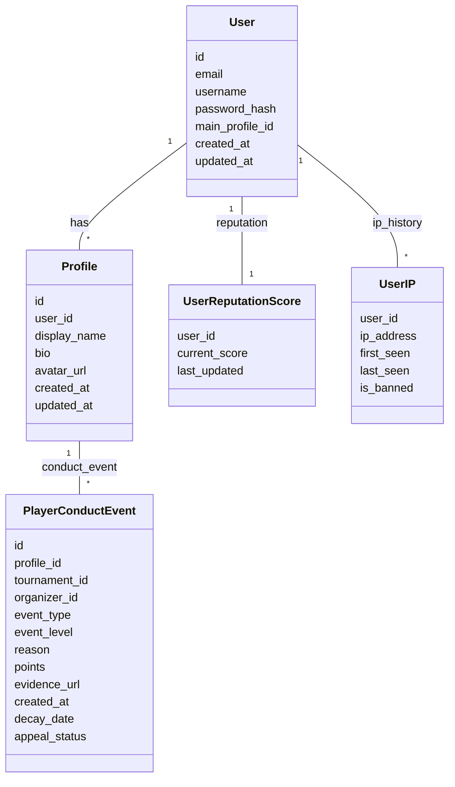
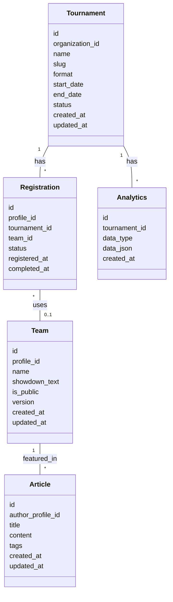
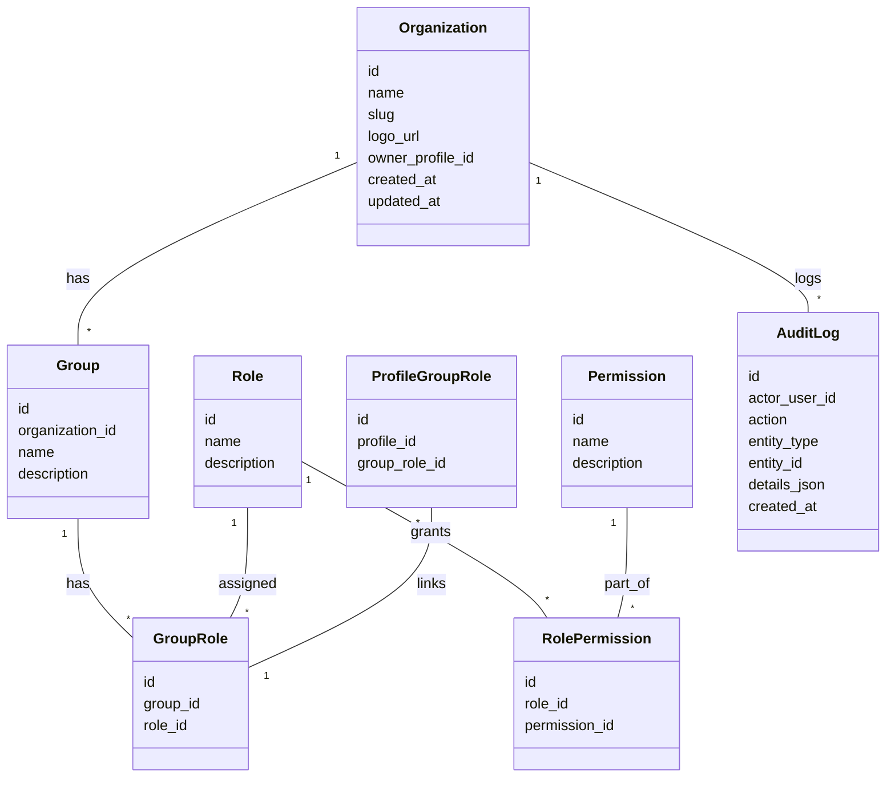

# Database Diagram

## 🗺️ Master System Diagram (Full Reference)

> This diagram shows all entities and all relationships in the system, including cross-domain links. Use this for a holistic view. See below for focused, split diagrams.

<!--
Legend (for use in Mermaid Live Editor):
- Blue: Users & Profiles
- Orange: Conduct & Reputation
- Green: Tournaments & Registration
- Purple: RBAC & Organizations
-->

---

## 1️⃣ Profile & Reputation

---

> **Note:** Mermaid color-coding and grouping (classDef, etc.) are not rendered in Obsidian.
> Use the Mermaid Live Editor or export to SVG/PNG for color/grouping visualization.

---

## 2️⃣ Tournaments & Registration

---

## 3️⃣ RBAC & Organizations

---

**Legend:**

- `id` is always the primary key for each table.
- Fields ending in `_id` are foreign keys referencing other tables.

---

_This diagram is a living document and should be updated as the data model evolves._
