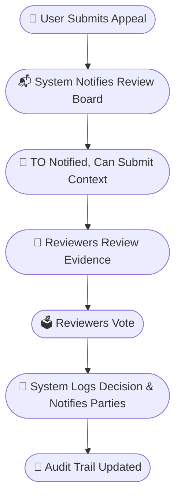
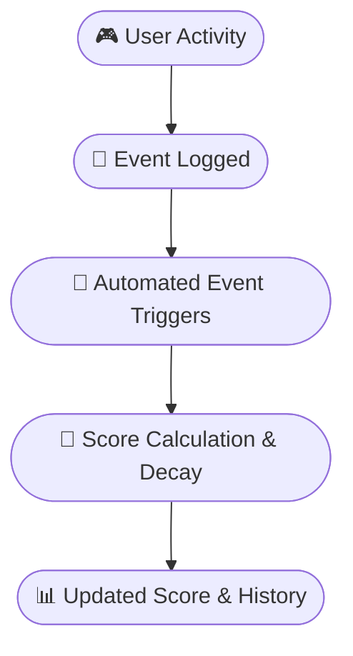
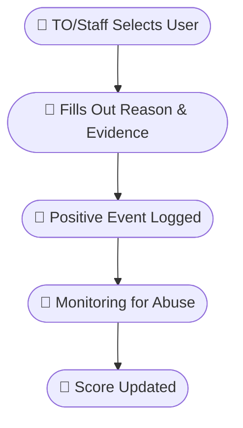
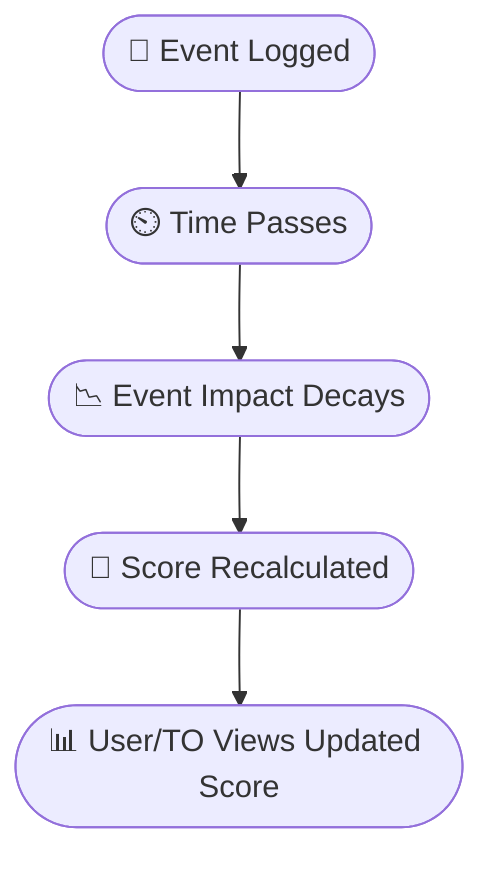
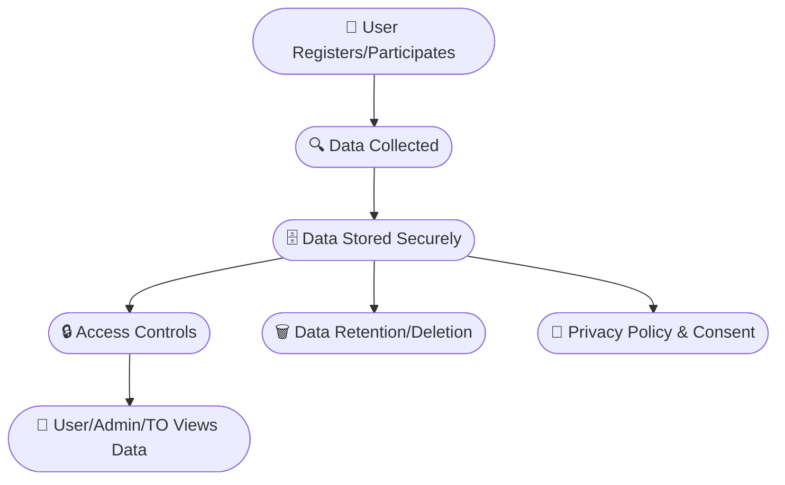

# 🔍 Reputation System Deep Dive

---

## 📝✨ Decisions Summary

### 🏛️ Appeals

- ⏳ Appeals are **asynchronous**, not a live panel.
- 🗓️ Users have **7 days** to submit an appeal after an event is logged.
- 🧑‍⚖️ The review panel is **initially handpicked by site admins**; in the future, a **democratic, regionally representative system** is planned.
- 🔄 Users may **appeal the same event more than once** if new evidence arises.

### 🌟 Positive Behavior

- 📝 Positive events require a **reason and evidence** (required for both positive and negative events).
- 👀 All positive events are **logged and monitored** for suspicious activity.
- 🚫 Users **cannot currently nominate others** for positive recognition (to prevent abuse); this may be revisited later.
- ⚖️ Positive events should be **weighted differently** (e.g., +2 for helpful, +5 for exceptional sportsmanship). **Automated systems** (e.g., sentiment analysis, community engagement, article writing) should also grant positive points.
- 🧮 The reputation system is **not a simple sum**; it is a nuanced, weighted, decaying model. **Positive events decay slower** than negative ones, but **negative events are weighted higher**.
- 🎯 The score range is **0–100**, with 0 representing the worst behavior and 100 the best (e.g., "Hitler" to "Bob Ross").

### 🔒 Privacy

- 🕵️‍♂️ Users can **opt out of IP tracking**, but may not be able to participate in tournaments that require it. TOs can require IP tracking for their events.
- 🗄️ IP addresses should be **retained for at least 6 months** after a user is banned or leaves the platform (subject to further tuning).
- 📜 Users are **notified about IP logging only in the privacy policy**, not every time an IP is logged.

---

## 🔄🗂️ System Flowcharts & Diagrams

### 📨 Asynchronous Appeal Process (Mermaid Diagram)

Below is a flowchart showing how an appeal moves through the system:



### 🏆 Reputation System (Mermaid Diagram)

This diagram shows how user actions and events affect their reputation score:



### 🌟 Positive Event Nomination (Mermaid Diagram)

How a TO or staff member nominates a user for a positive event:



### ⏳ Score Decay & Update (Mermaid Diagram)

How the system decays event impact and updates scores over time:



### 🔒 User Privacy & Data Flow (Mermaid Diagram)

How user data is collected, stored, and accessed:



---

## 🖼️🎨 UI/UX Wireframe Descriptions

### 1️⃣ Appeal Process (User Dashboard)

- **📋 Conduct Record Table:**
  - 🗓️ Date | 🏷️ Type | 🎚️ Level | 🔢 Points | ⏳ Decay Date | 🔗 Evidence | 🟢 Status
  - 🆘 "Appeal" button next to eligible events
- **📝 Appeal Modal:**
  - 🖊️ Text area for written statement
  - 📎 File upload for evidence
  - 🚀 Submit button (shows time left to appeal)
- **🔄 Appeal Status:**
  - 🟡 Pending | 🟢 Approved | 🔴 Rejected
  - 🕰️ Timeline of appeal (submitted, under review, decision, rationale)

### 2️⃣ Positive Event Nomination (TO/Staff Dashboard)

- **🌟 Nominate Positive Event:**
  - 👤 Select user from tournament roster
  - 🏷️ Dropdown for event type/level (e.g., "helpful", "exceptional sportsmanship")
  - 🖊️ Text area for reason (required)
  - 📎 File upload for evidence (required)
  - 🚀 Submit button
- **🔍 Monitoring:**
  - 📑 List of all positive events submitted (with filters for suspicious activity)

### 3️⃣ Reputation Overview (User Profile)

- **📈 Score Gauge:**
  - Visual indicator (0–100 scale, color-coded)
- **🕒 Event Timeline:**
  - Chronological list of all events, with icons for type/level, decay countdown, and evidence links
- **🏅 Badges/Leaderboard:**
  - Display earned badges and current leaderboard position (if enabled)

---

## 🛠️💡 Technical Implementation Planning

### 1️⃣ Data Model

- 📄 See `PlayerConductEvent`, `UserReputationScore`, `UserIP` in the main spec.
- 🗃️ Add tables for appeals, evidence, and audit logs if needed.

### 2️⃣ Backend

- 🔗 API endpoints for:
  - 📝 Logging events (positive/negative)
  - 📬 Submitting and managing appeals
  - 🤖 Automated event triggers (e.g., sentiment analysis, engagement)
  - 🧮 Score calculation and decay jobs (scheduled tasks)
  - 🧑‍⚖️ Admin review workflows
- 🔒 Security: strict access controls, audit logging, encrypted storage

### 3️⃣ Frontend

- 🖥️ User dashboard for conduct record, appeals, and score overview
- 🏢 TO/staff dashboard for event logging and monitoring
- 🛡️ Admin dashboard for reviewing appeals and monitoring system health
- 🔔 Notification system for status updates

### 4️⃣ Automation & Monitoring

- 🤖 Integrate sentiment analysis and engagement tracking for automated positive events
- 🕵️ Monitor for abuse (e.g., excessive positive/negative event logging)
- ⏲️ Scheduled jobs for score decay and event status updates

### 5️⃣ Privacy & Compliance

- ✅ Consent management for IP tracking
- 🗑️ Data retention and deletion workflows
- 📜 Privacy policy display and update notifications

---

## 📊 Reputation Score Gauge Example

```
[ 0 |----|----|----|----|----|----|----|----|----| 100 ]
      🎯
   (User's current score)
```

---

## 📜🔒 Template Privacy Policy (Draft)

> ### Privacy Policy (Draft)
>
> **🔍 What We Collect:**
>
> - 👤 User profile information (name, email, etc.)
> - 📝 Conduct records (events, appeals, outcomes)
> - 🌐 IP addresses (for anti-abuse and security)
>
> **🔧 How We Use Your Data:**
>
> - 🏆 To maintain fair play and community standards
> - 🚫 To prevent abuse, ban evasion, and ensure tournament integrity
> - 🗂️ To allow users to view and appeal their conduct records
>
> **👀 Who Can See Your Data:**
>
> - 🔒 Only site admins and security staff can access sensitive data (e.g., IP addresses)
> - 🏢 Tournament Organizers can only see conduct records for their own tournaments
> - 👤 Users can view their own conduct records and data
>
> **🛡️ Your Rights:**
>
> - 👁️ You can view all data we hold about you
> - 🗑️ You can request correction or deletion of your data (subject to legal/anti-abuse exceptions)
> - 🆘 You can appeal any conduct event on your record
>
> **⏳ Data Retention:**
>
> - 📝 Conduct events are permanent, but their impact on your score decays over time
> - 🌐 IP addresses are retained only as long as necessary for anti-abuse and security
>
> **🔐 Security:**
>
> - 🗄️ All sensitive data is encrypted at rest
> - 🕵️ All access to sensitive data is logged and auditable
>
> **📬 Contact:**
>
> - For privacy concerns or requests, contact [privacy@yourdomain.com]
>
> **🔔 Policy Updates:**
>
> - We will notify you of any changes to this policy

---

_Feel free to request visual diagrams, further breakdowns, or implementation details for any section!_
