# Team Builder Landing — Full Design Spec

**Status:** Design complete + implemented — Phase 1 (#376) + Phase 2 (#377) shipped; test-hardening pending. See [README.md — Implementation status](./README.md#implementation-status) for a full shipped/deferred breakdown.
**Date:** 2026-06-22 · **Expanded:** 2026-06-23 (added Quick-look, List controls, Bulk actions, Archive & safety; flipped row anatomy to name-first)
**Companion docs:** [`README.md`](./README.md) (overview + mockup gallery + implementation status) · `docs/builder-single-focus-redesign/` (the editor middle-section work — separate, non-overlapping)

> Every wireframe referenced below lives in [`mockups/`](./mockups/) as both a PNG and a self-contained HTML you can open in a browser. The **Decision Log** (§21) records why each choice won and what was rejected, each linked to its mock.

---

## 1. Context

Navigating to `/builder` today drops you **straight into editing a single team** (localStorage-backed, works logged-out). Switching teams means digging through a `File ▾` menu. There is no "here are all my teams" surface.

Pokémon Showdown's teambuilder is the reference standard: it lands on a list of your teams with format folders, stored only in the browser. **The goal is to beat that standard, not match it** — a rich, organized team-management home that leans into trainers.gg's real differentiators (accounts, **alts**, tournament/usage data) that Showdown's local-only model cannot offer.

---

## 2. Goals / Non-Goals

**Goals**
- A landing surface at `/builder` that lists all of a user's teams, richly organized.
- First-class **alts** support (the key differentiator) without confusing them with the account.
- **Folders**: auto (generation→format), manual (hand-curated), and **Smart Folders** (saved queries).
- A **rich search** across every Pokémon detail, not just team names.
- **Peek a team without opening it** — inspect the full 6 (items, moves, tera) before committing to a navigation.
- **Manage at scale** — sort, density, pin-to-top, manual ordering, keyboard navigation, and bulk multi-select actions for users with many teams.
- **A safe lifecycle** — a reversible Archive plus an undo safety net on destructive delete; graceful loading/error states; a workspace that remembers your preferences.
- Equal desktop and mobile quality.
- An empty/first-run state that is *the real workspace, just empty* — welcoming, never barren.

**Non-Goals**
- Redesigning the editor itself (`builder-single-focus-redesign` owns that).
- Social/sharing surfaces beyond the existing "Make public" toggle.
- Finalizing the data source for "sample" starter teams (a follow-up — see §20).
- Surfacing tournament-usage or meta-fit data on the row (parked — see Decision Log "Parked & Rejected").

---

## 3. Core Concepts

### 3.1 Account vs Alt (the un-confusing rule)
- **Top-bar avatar = your account** (the human). Untouched by this feature.
- An **alt = a competitive identity** you own; teams belong to an alt (`teams.created_by → alts.id`).
- There is exactly **one** place to choose which alt you're viewing — the "Viewing" control (§5). Alts are deliberately **not** a section in the folder rail, to avoid duplicating the account/alt distinction the chrome already carries.

### 3.2 The three folder types
| Type | Icon | Source | Storage |
| --- | --- | --- | --- |
| **Auto** | 🧬 | Derived from each team's generation→format | None (computed) |
| **Manual** | ⭐ | Hand-curated buckets you drag teams into | New: folder + membership |
| **Smart** | ⚡ | A saved query that auto-populates | New: stored criteria/query |

In addition, one **system** view — **🗄 Archived** (§14) — holds archived teams. It is not a folder you file into; it is where archived teams live until restored.

### 3.3 Generation taxonomy (was undocumented)
Champions **Reg M-A, Reg M-B, and Legends Z-A are all Generation 9** — same generation as the VGC regs (Reg H, etc.). Auto-folders group as `Gen 9 ▸ {Champions Reg MA, VGC Reg H, Legends ZA, …}`. Also being folded into the `parsing-pokemon` skill so it lives beyond this doc.

### 3.4 Team lifecycle (sync + archive states)
```
☁ Local draft  ──Save to alt──▶  ✓ Synced (on an alt, all devices, auto-saves)
(this device, no alt yet)                              │
        └────────────── 🔒 Local-only (deliberate, sticky) ──────────────┘

Any team ──Archive──▶ 🗄 Archived (kept, hidden from main views) ──Restore──▶ back
Any team ──Delete──▶  permanently removed (with a brief Undo toast)
```
See §9 for sync behavior and §14 for archive/delete behavior.

---

## 4. Layout & Chrome Integration

A **two-pane workspace** nested inside the existing builder chrome (global top bar above, bottom dock below). On the landing, the editor-only dock panels (Type matchups / Speed tiers / Damage calc) are hidden; the disclaimer + © remain.

```
┌ top bar (global): trainers.gg / Builder · "My Teams" · ⚙ 🔔 · (A) account ┐
├ toolbar: Viewing [All alts][A admin][AK ash][▾ more]  🔍 Search…  [Sort ▾][▤▣ density]  [+ New Team] ┤
├──────────────┬───────────────────────────────────────────────────────────────┤
│ RAIL (slim,  │ MAIN: collapsible sections of rich row-cards                   │
│ collapsible) │   ▾ 📌 Pinned                                                   │
│ 🏠 All teams │      [row card] [row card]                                      │
│ ⚡ Smart…    │   ▾ ⚡ Incomplete  (criteria chip)                              │
│ 🧬 Gen 9…    │      [row card]                                                 │
│ ⭐ My folders│   ▾ 🧬 Champions Reg M-B                                        │
│ 🗄 Archived  │      [row card] [row card]                                      │
└──────────────┴───────────────────────────────────────────────────────────────┘
└ bottom dock (global): disclaimer · © ────────────────────────────────────────┘
```

- **Rail** = jump-nav / table of contents (folders + the 🗄 Archived system view; collapsible, folds away).
- **Toolbar** carries the Viewing pills, search, and the **Sort + density** controls (§12).
- **Main** = collapsible sections. Selecting a rail node scopes the main area; "All teams" shows everything grouped into sections (📌 Pinned first, then Smart/auto/manual folders). Nothing is hidden behind drilling — sections expand/collapse in place.

This pairing is the merge of two folder-surface options (sections + rail) — see Decision 7. The chrome facts come from the live builder screenshots reviewed during design.

---

## 5. The "Viewing" Alt Control

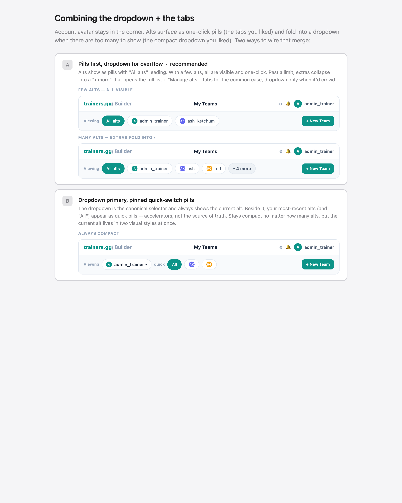

*Mock: [alt-combo.html](mockups/alt-combo.html)*

Alts surface as one-click **pills**, led by **"All alts"**. The account avatar stays in the top-right corner, visually distinct.

**States:**
- **Few alts** — all pills visible; one click switches scope.
- **Many alts** — extras fold into a **`▾ N more`** dropdown that opens the full list plus "Manage alts".

When **All alts** is active, each team row carries a small **alt mini-badge** so ownership stays legible across alts.

> Earlier options (scope-dropdown vs tabs) are in [alt-model.html](mockups/alt-model.html). See Decision 5.

---

## 6. Rich Search

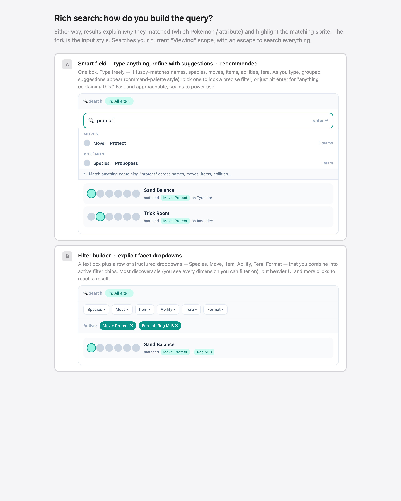

*Mock: [rich-search.html](mockups/rich-search.html)*

A **smart single field** (command-palette style), scoped to the current "Viewing" selection with an `in: All alts` escape hatch.

- **Matches across:** team name, and per Pokémon — species, nickname, item, ability, all four moves, nature, tera type.
- **As you type:** grouped suggestions appear (Moves / Pokémon / Items / …). Pick one to lock a precise filter, or press enter for "anything containing this."
- **Predicates** beyond free text: `incomplete`, `illegal`, `legal`, `has:tyranitar`, `format:reg-h`.
- **Results explain the match** — e.g. *"matched `Move: Protect` on Tyranitar"* — and **highlight the matching sprite(s)**.
- **Keyboard:** `⌘K` / `Ctrl-K` focuses the field from anywhere on the landing (§12).

> See Decision 6 for smart-field vs explicit filter-builder.

---

## 7. Organization: Rail + Sections

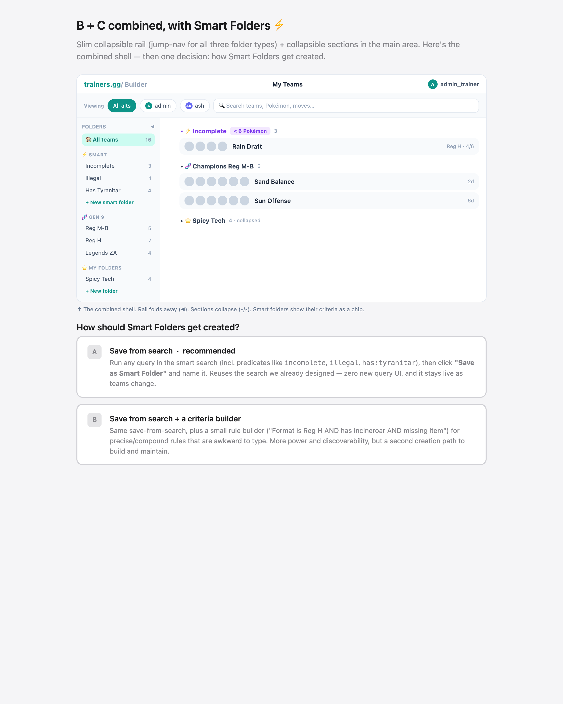

*Mock: [smart-folders.html](mockups/smart-folders.html) · folder-surface options explored in [folders.html](mockups/folders.html)*

### 7.1 Rail (left, slim, collapsible)
Groups, top to bottom:
- `🏠 All teams (count)`
- `⚡ Smart` — seeded defaults + user-created (see §8)
- `🧬 Gen 9` — auto format sub-items (Reg M-B, Reg H, Legends ZA…); appears only once at least one team exists
- `⭐ My folders` — manual folders + `+ New folder`
- `System` — `🗄 Archived (count)` (§14); muted, sits at the bottom

Each item shows a live count. The rail collapses to reclaim width (`⌘\` toggles it — §12). **Pinned** teams are **not** a rail node; they surface as a section at the top of the main area (§12.3).

### 7.2 Main sections
The selected rail node scopes the main area. "All teams" renders everything as **collapsible sections** (`▾`/`▸`): **📌 Pinned** first (if any), then groups by generation→format and then manual/smart folders. Smart Folder sections show their **criteria as a chip** (e.g. `< 6 Pokémon`).

---

## 8. Smart Folders ⚡


*Mock: [smart-folders.html](mockups/smart-folders.html)*

A Smart Folder is a **saved search that auto-populates**. Created **two ways** (both supported):

1. **Save from search** — run any query in the smart search, click **"Save as Smart Folder"**, name it.
2. **Criteria builder** — a small rule builder for precise/compound rules that are awkward to type, e.g. `Format is Reg H AND has Incineroar AND missing item`.

**Seeded defaults** ship in the rail (editable / removable), shown muted at count 0 until they match:
| Name | Criteria |
| --- | --- |
| Incomplete | `< 6 Pokémon` |
| Illegal | `format_legal = false` |
| Recently edited | updated within the last N days |

> See Decision 8 (creation method) and Decision 12 (seeding).

---

## 9. Sync / Local ↔ Account

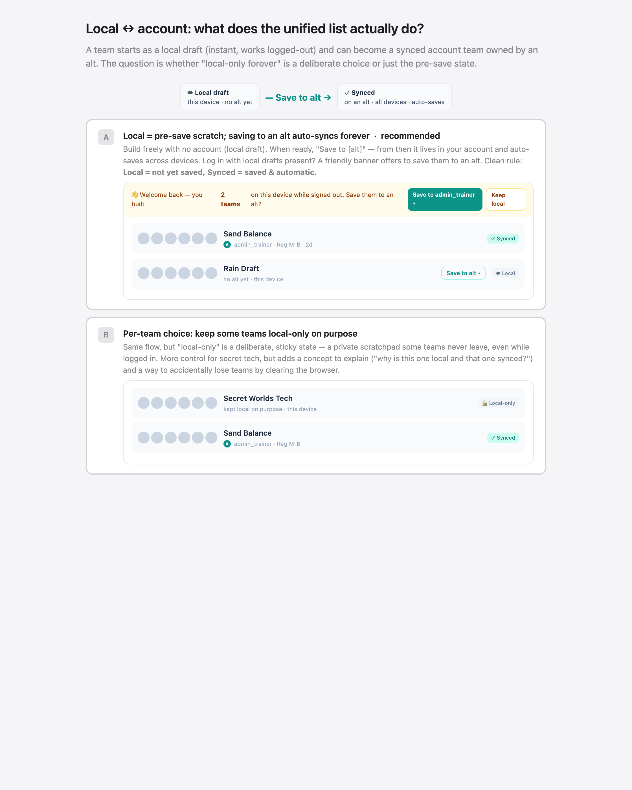

*Mock: [sync-model.html](mockups/sync-model.html)*

**Default behavior (pre-save scratch):**
- Build freely with no account → **☁ Local draft** (this device, no alt yet).
- Click **"Save to [alt]"** → becomes **✓ Synced**; from then it lives in your account and auto-saves across devices.
- Rule of thumb: **Local = not saved yet, Synced = saved & automatic.**

**Deliberate Local-only (sticky):**
- A team can be kept **🔒 Local-only** on purpose — a private scratchpad that never leaves the device, even while logged in. Set via the row's `⋯` menu (toggle). Carries a subtle "easy to lose if you clear the browser" caveat. (A bulk **Export / back-up all** mitigates the loss risk — see §13.3.)

**Login reconcile banner** (shown when logging in with local drafts present):
> 👋 Welcome back — you built **N teams** on this device while signed out. Save them to an alt?  · `[Save to admin_trainer ▾]` `[Keep local]`

**Badges:** `☁ Local` (gray) · `🔒 Local-only` (gray, lock) · `✓ Synced` (teal).

> See Decision 9.

---

## 10. Team Row — Anatomy & Actions

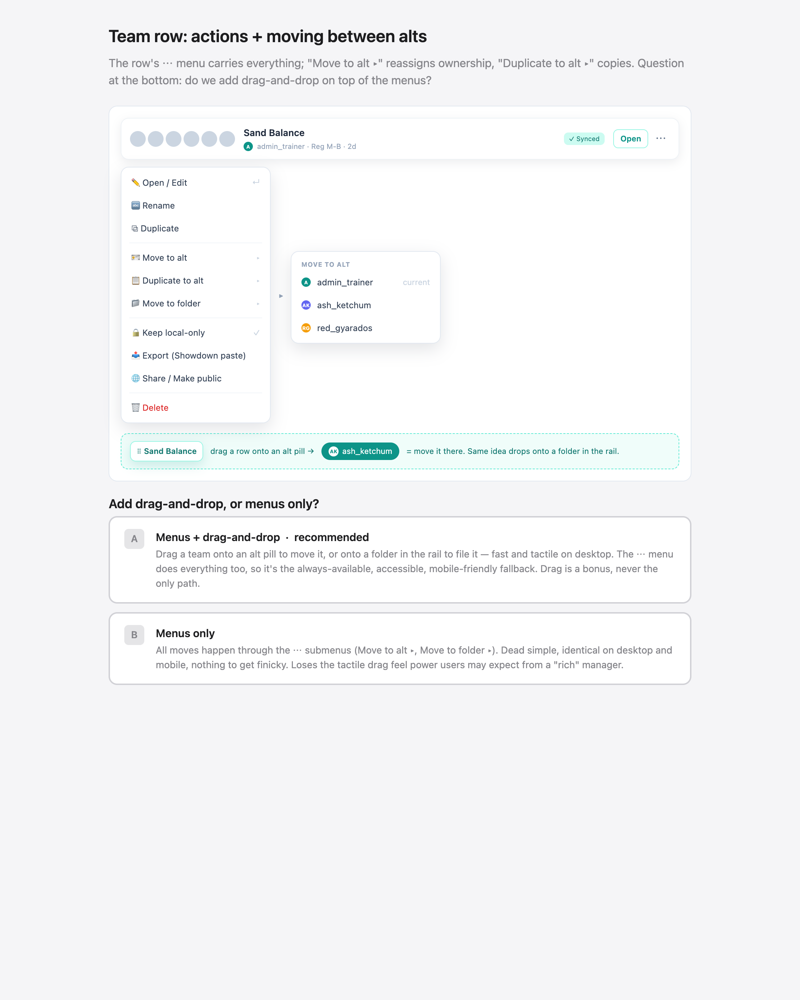

*Mock: [row-actions.html](mockups/row-actions.html) · updated row order + pin/density/grip in [list-controls.html](mockups/list-controls.html)*

### 10.1 Row anatomy (name-first)
**The row reads name-first** (changed 2026-06-23 — see Decision 17):

`[drag grip ⠿] [select ☑] · Team name · 📌 (if pinned) · [6 sprites] · format pill · sync badge · alt mini-badge (when viewing All alts) · ⋯`

- The **name sits first**, in a **fixed-width column**, so the sprite cluster lines up in a tidy column down the list; long names **truncate with an ellipsis**.
- The **📌 pin badge** sits **immediately to the right of the name** (not on the far left).
- Empty slots render as muted circles (e.g. a 4/6 draft shows two empty); the slot count doubles as the "incomplete" signal (the ⚡ Incomplete smart folder is the global view of the same fact).
- **Leading edge (far left):** a **drag grip ⠿** appears when the sort is *Custom order* or inside a manual folder (§12.4); a **selection checkbox** fades in on hover and stays once any row is selected (§13).
- **On hover:** the row elevates, a **quick-look** popover can open (§11), and an **Open** quick-action + the `⋯` appear.

This name-first order applies to **every** team row across the spec (landing sections, search results, pinned, archived, mobile cards).

### 10.2 `⋯` menu (always available — the a11y / mobile path)
- Open / Edit · Rename · Duplicate · **Pin to top (toggle)**
- **Move to alt ▸** (reassigns owner) · **Duplicate to alt ▸** (copies) · Move to folder ▸
- Keep local-only (toggle) · Export (Showdown paste) · Share / Make public
- **🗄 Archive** (reversible — §14) · **Delete** (destructive, styled red; shows an Undo toast — §14)

Every `⋯` action that makes sense in bulk is also available from the bulk action bar (§13).

### 10.3 Moving between alts
- **Menu:** `Move to alt ▸` opens a submenu of the user's alts (current alt marked).
- **Drag (enhancement):** drag a row onto an **alt pill** to move it, or onto a **folder** in the rail to file it.
- **Move** reassigns ownership; **Duplicate to alt** copies (the existing fork behavior).

> See Decision 10 (menus + drag vs menus only).

---

## 11. Quick-Look Peek 👀

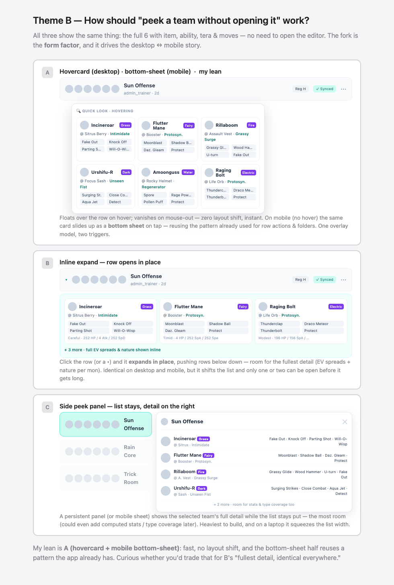

*Mock: [quick-look.html](mockups/quick-look.html)*

Inspect a team's full contents **without opening the editor** (which is a full route change — §17).

- **Desktop:** a **hovercard** floats over the row on hover and vanishes on mouse-out — **no layout shift**, instant.
- **Mobile (no hover):** the same content slides up as a **bottom sheet** on tap — reusing the bottom-sheet pattern already used for row actions and folders (§18). One overlay model, two triggers.
- **Content:** the **full 6 Pokémon**, each with **sprite, species, held item, ability, tera type, and all four moves**. (EV spreads/natures are out of scope for the peek to keep it skimmable — they live in the editor; see Rejected option B.)
- **Dismiss:** mouse-out (desktop) / tap-scrim or swipe-down (mobile).

> See Decision 14. Rejected: **inline expand** (fullest detail incl. EV spreads, but shifts the list and only one/two open before it gets long) and a **side peek panel** (most room, could grow to stats/coverage, but heaviest and squeezes the list on a laptop).

---

## 12. List Controls — Sort, Density, Pin, Manual Order, Keyboard ⚙️

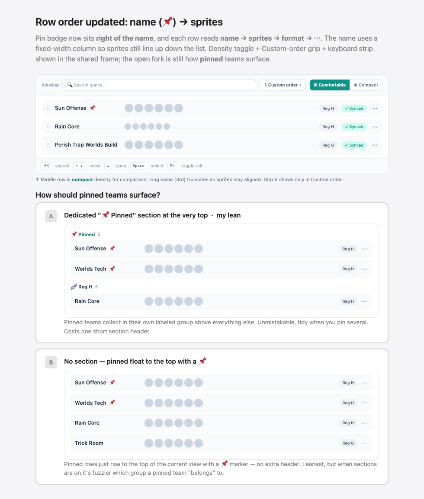

*Mock: [list-controls.html](mockups/list-controls.html)*

### 12.1 Sort
A toolbar **`Sort ▾`** control: **Recent** (default), **Name (A–Z)**, **Format**, **Completeness**, and **Custom order**. Choosing Custom order enables manual drag-reorder (§12.4). Sort applies within the active scope/sections; **pinned teams always float above the sort** (§12.3).

### 12.2 Density
A toolbar segmented toggle: **▤ Comfortable** (default) ↔ **▣ Compact** (tighter rows, more teams per screen). The choice is **remembered** across visits (§15.3).

### 12.3 Pin to top
- Pin a team (or a few) via the `⋯` menu **Pin to top** toggle; the **📌** badge shows to the right of its name (§10.1).
- Pinned teams collect in a **dedicated "📌 Pinned" section at the very top** of the main area, above all other sections — unmistakable and tidy when several are pinned.
- Light to store: a single per-team `pinned` flag (scoped to the owning user).

> See Decision 16 (dedicated section vs floated-in-place).

### 12.4 Manual reorder
- Available **only when the sort is *Custom order*** (and inside manual folders), so it never fights Recent/Name/Format ordering.
- A **drag grip ⠿** appears at the leading edge of each row; drag to reorder. Persisted as an explicit order value.

> Decision 18 kept manual reorder in scope (user override of the "skip it" recommendation); the Custom-order gating resolves the conflict-with-sort concern.

### 12.5 Keyboard navigation ⌨️
- `⌘K` / `Ctrl-K` — focus search
- `↑ ↓` (and `j` / `k`) — move selection between rows
- `↵` Enter — open the focused team
- `Space` — toggle selection of the focused row (feeds the bulk bar — §13)
- `⌘\` / `Ctrl-\` — collapse/expand the rail

An accessibility win as much as a power-user one; the focus ring and roving-tabindex make the list fully operable without a mouse.

> See Decision 18 (scope of the small controls).

---

## 13. Bulk Selection & Actions

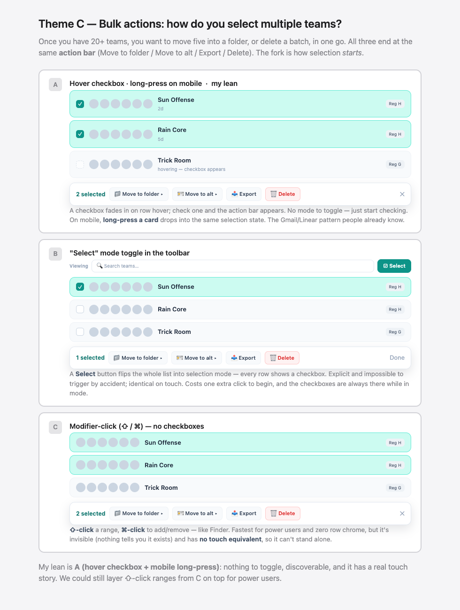

*Mock: [bulk-actions.html](mockups/bulk-actions.html)*

### 13.1 Entering selection
- **Desktop:** a **checkbox fades in on row hover**; check one and the action bar appears. No mode to toggle — just start checking. (The Gmail/Linear pattern.) **⇧-click** selects a range and **⌘-click** adds/removes — layered on for power users.
- **Mobile:** **long-press a card** drops into the same selection state (no hover equivalent).
- Once any row is selected, checkboxes stay visible on all rows so you can keep adding; a count shows in the bar.

### 13.2 The action bar
A bar (sticky, thumb-reachable) shows **`N selected`** and the bulk-applicable actions, mirroring the `⋯` menu:
- **📁 Move to folder ▸** · **🪪 Move to alt ▸** · **📤 Export** · **🗄 Archive** · **🗑 Delete** (red) · **✕ / Clear**

### 13.3 Export / back-up all
- **Export** on a selection concatenates the chosen teams to a single Showdown paste (per-team export already exists in the `⋯` menu — §10.2).
- A top-level **"Export / back up all teams"** (selection-independent) closes the "local drafts are easy to lose if you clear the browser" gap (§9). One click → a downloadable bundle of every team's paste.

> See Decision 15 (selection entry: hover checkbox + long-press vs select-mode toggle vs modifier-click only).

---

## 14. Archive, Delete & the Safety Net 🛟

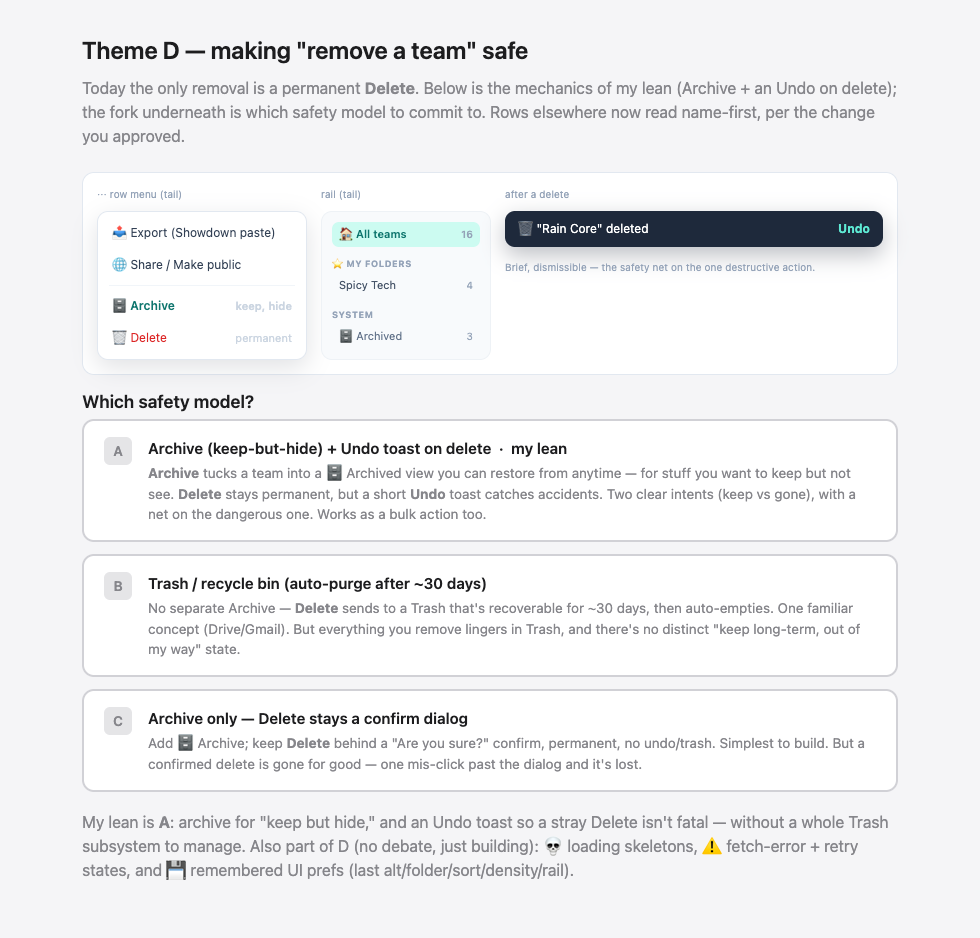

*Mock: [archive-safety.html](mockups/archive-safety.html)*

Two clear intents, with a net on the destructive one:

- **🗄 Archive (keep, hide):** tucks a team into the **🗄 Archived** system view (rail, §7.1) — for teams you want to keep but not see in your main lists. **Restore** anytime from the Archived view. Available per-row (`⋯` menu) and in bulk (§13.2). Stored as a per-team `archived` flag; archived teams are excluded from all default views (sections, smart/auto/manual folders, counts) and from search unless you're in the Archived view.
- **🗑 Delete (permanent):** removes the team, but a brief, dismissible **Undo toast** ("'Rain Core' deleted · Undo") catches accidents. The same toast appears after a **bulk** delete ("N teams deleted · Undo").

> See Decision 19. Rejected: a full **Trash / recycle bin** (auto-purge after ~30 days — one familiar concept, but everything lingers and there's no distinct "keep long-term, out of the way" state) and **Archive-only** with a confirm-dialog delete (simplest, but a confirmed delete is gone for good).

---

## 15. Loading, Error & Persistence States

*(No separate mock — these are standard states layered onto the existing shell.)*

### 15.1 Loading
Account teams load server-side (SSR — §17). While the unified list resolves (and on client refetch), render **skeleton rows** in the shell — the toolbar, rail, and section scaffolding stay put; only the row contents shimmer. Optimistic insert on **+ New Team** so a new team appears immediately.

### 15.2 Error / offline
If the account-teams fetch fails, show a non-destructive **inline error with a Retry** in the main area (local drafts still render — they never depend on the network). An offline indicator degrades gracefully; the local-first flow keeps working.

### 15.3 Persisted UI preferences
Remember, per user/device: **last-viewed alt scope, last-selected folder/rail node, sort mode, density, and rail collapsed/expanded**. The workspace reopens the way you left it.

---

## 16. Empty / First-Run States

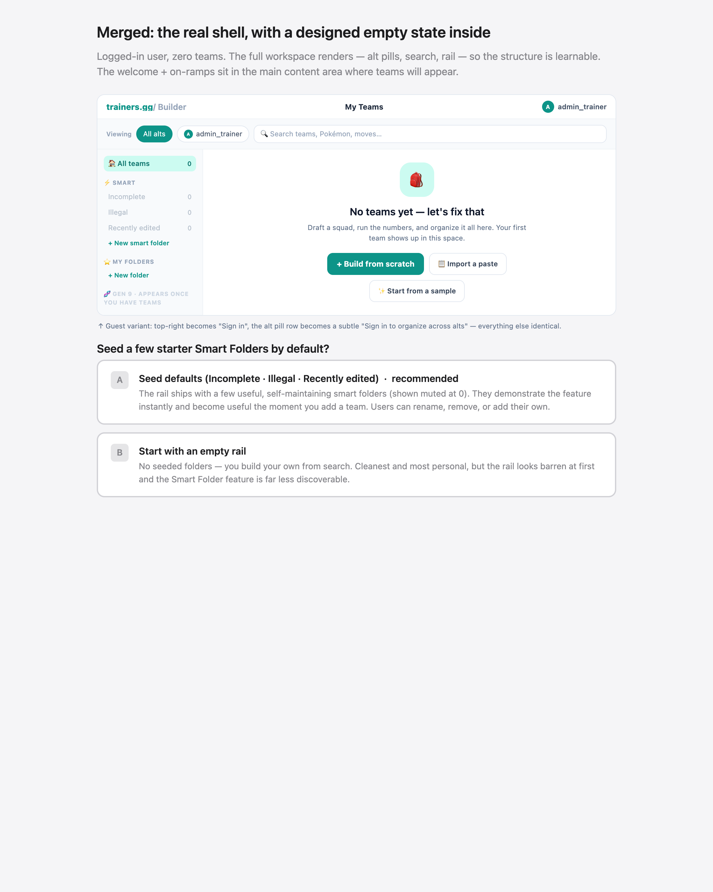

*Mock: [empty-merged.html](mockups/empty-merged.html) · on-ramps in [empty-states.html](mockups/empty-states.html)*

The full shell renders even with zero teams — alt pills, search, and rail (with muted seeded Smart Folders) are all present so the **structure is learnable immediately**. The welcome content sits **inside the main content area** where teams will appear (it is not a full-page takeover).

**Welcome content (logged-in, zero teams):**
- Headline: *"No teams yet — let's fix that"*
- Sub: *"Draft a squad, run the numbers, and organize it all here. Your first team shows up in this space."*
- On-ramps: **+ Build from scratch** (primary) · **📋 Import a paste** · **✨ Start from a sample**
- 🧬 Gen 9 auto-group and the 📌 Pinned / 🗄 Archived rows stay hidden until they have content.

**Guest variant:** top-right becomes **"Sign in"**; the alt pill row becomes a subtle *"Sign in to organize across alts."* Everything else identical. First-run headline reads *"Let's build your first team"* with a guest note: *"Building as a guest — your teams save to this device. Sign in to sync everywhere & organize across alts."*

**Smaller empties:**
- Empty folder: *"Nothing in ⭐ Spicy Tech yet — drag teams here, or + New team."*
- No search results: *"No teams match 'gholdengo'. Try another name, Pokémon, or move."*
- Empty smart folder: *"No teams are Incomplete right now — nice work. 🎉"*
- Empty Archived: *"Nothing archived. Archived teams are kept here, out of your main lists."*

> See Decision 11 (on-ramps) and Decision 12 (render-real-shell merge + seeding).

---

## 17. Navigation & New Team

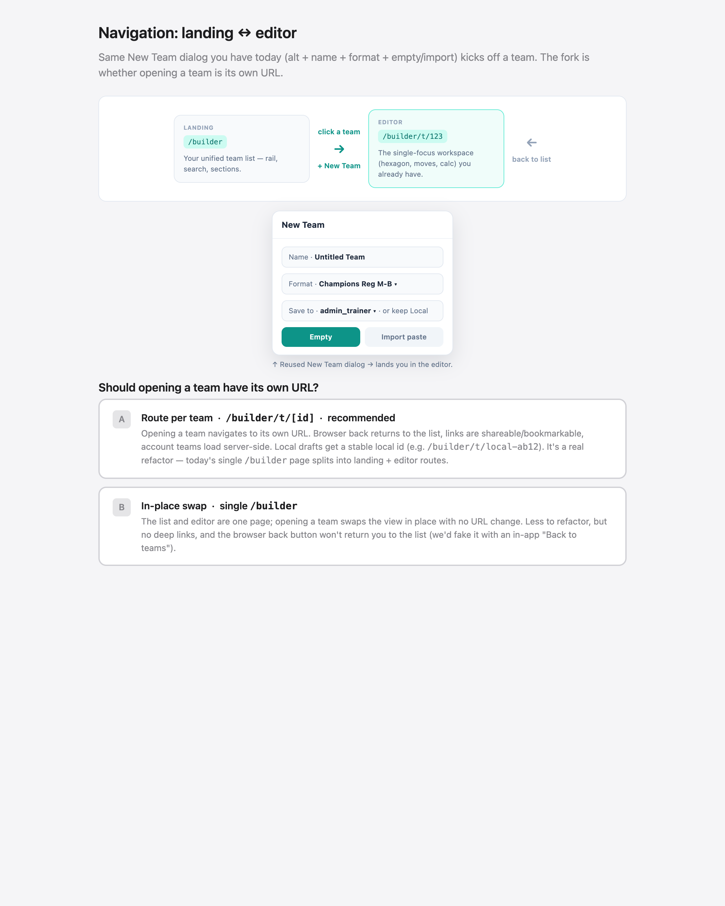

*Mock: [routing.html](mockups/routing.html)*

**Route per team.** `/builder` = landing; opening a team navigates to its **own URL** (`/builder/t/[id]`).
- Browser back returns to the list; links are shareable/bookmarkable; account teams load server-side (SSR).
- Local drafts get a stable local id (e.g. `/builder/t/local-ab12`).
- This is a real refactor: today's single `/builder` page splits into a **landing route** + an **editor route**.

**New Team** reuses the existing `NewTeamDialog`: `Name` + `Format ▾` + `Save to [alt] ▾ / keep Local` + `Empty | Import paste` mode → lands you in the editor.

> See the routing decision in §21.

---

## 18. Mobile

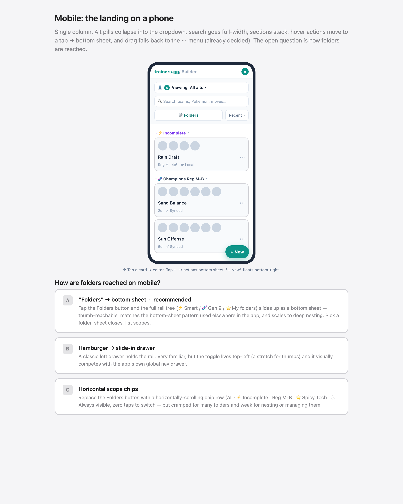

*Mock: [mobile.html](mockups/mobile.html)*

Single column, equal priority:
- Alt pills collapse into the **"Viewing" dropdown**; search goes full-width; **Sort + density** sit in the compact tool row.
- A **"Folders" button opens the full rail tree as a bottom sheet** — thumb-reachable, matches the app's bottom-sheet pattern, scales to nesting; the 🗄 Archived view lives in the same sheet.
- Sections stack and collapse, **📌 Pinned first**; cards use the same **name-first** order (§10.1).
- **Tap a card → editor.** **Tap-and-hold a card → quick-look bottom sheet** (§11). **Tap `⋯` → actions bottom sheet** (Archive/Delete/Pin/Move/Export). **Long-press → multi-select** (§13). Drag falls back to the menus.
- `+ New` floats as a bottom-right FAB.

> See Decision 13 (bottom sheet vs drawer vs chips).

---

## 19. Provenance — Mockups → Decisions

The design was built one decision at a time with a live visual companion. Full index in [`README.md`](./README.md#mockup-gallery); each mock below is in [`mockups/`](./mockups/) (PNG + HTML):

| # | Mock | Drove |
| --- | --- | --- |
| 1 | [layout](mockups/layout.html) | landing layout → blend (Decision 2) |
| 2 | [layout-hybrid](mockups/layout-hybrid.html) | not flat (Decision 3) |
| 3 | [org-hierarchy](mockups/org-hierarchy.html) | superseded org tree (§21) |
| 4 | [alt-model](mockups/alt-model.html) | alt control options (Decision 4) |
| 5 | [alt-combo](mockups/alt-combo.html) | alt pills + overflow (Decision 5) |
| 6 | [rich-search](mockups/rich-search.html) | smart search (Decision 6) |
| 7 | [folders](mockups/folders.html) | folder surface (Decision 7) |
| 8 | [smart-folders](mockups/smart-folders.html) | rail+sections + Smart Folders (Decisions 7, 8) |
| 9 | [sync-model](mockups/sync-model.html) | sync model (Decision 9) |
| 10 | [row-actions](mockups/row-actions.html) | row actions + move-between-alts (Decision 10) |
| 11 | [empty-states](mockups/empty-states.html) | on-ramps (Decision 11) |
| 12 | [empty-merged](mockups/empty-merged.html) | full-shell empty + seeding (Decision 12) |
| 13 | [mobile](mockups/mobile.html) | mobile folders (Decision 13) |
| 14 | [quick-look](mockups/quick-look.html) | peek form factor (Decision 14) |
| 15 | [bulk-actions](mockups/bulk-actions.html) | bulk-select entry (Decision 15) |
| 16 | [list-controls](mockups/list-controls.html) | pin surfacing + name-first + small controls (Decisions 16–18) |
| 17 | [archive-safety](mockups/archive-safety.html) | archive/delete safety model (Decision 19) |
| — | [routing](mockups/routing.html) | route-per-team (§21) |

---

## 20. Implementation Considerations

> **Implementation gaps resolved 2026-06-23** (closing the open data/architecture choices that this section previously left as "either/or"):
> - **Data bucket — teams are P-bucket (per-user, RLS).** Reads use a **direct authenticated browser client + RLS**, with **SSR in the user's context** (`createClientReadOnly()`) for first paint — never `/api/v1`, never public/`'use cache'` caching. Mandated by the `deciding-data-access` / architecture rules (teams are explicitly listed P-bucket).
> - **Search + quick-look share one enriched list.** Load per-Pokémon species / item / ability / four moves / tera / nature for all 6 **once**; both the smart search and the quick-look peek filter/read that **in-memory** set. No dedicated search RPC, no per-row hover fetch, no N+1.
> - **Smart Folder criteria = `criteria jsonb`, flat AND-only (v1).** A versioned predicate list — predicate types `text` / `field` (move·item·ability·species·nickname·nature·tera) / `flag` (incomplete·illegal·legal) / `format` / `updated_within`. **One client-side evaluator powers both live search and folder population**; "Save as Smart Folder" just serializes the current query. OR / nested groups deferred (schema is versioned, so additive later).
> - **Delete Undo = deferred-commit (client-side).** Hold the delete during the toast window (single or bulk); Undo cancels it, otherwise the real delete fires; a pending delete is flushed on navigate-away. **No soft-delete column / trash subsystem** (consistent with D19).
> - **Scope = responsive web only.** The §18 patterns are responsive-web. Expo parity is tracked via a Linear ticket and built when mobile dev resumes.
> - **Routing coordination.** The editor-redesign effort (`builder-single-focus-redesign`) is in flight in a separate worktree; its work is internal to the editor's middle section and does **not** touch routing. The one shared touchpoint is the `/builder` page entry / `local-builder-workspace.tsx` — so the routing split (§17) should land as one atomic early-phase PR.

**Reuse (already exists):**
- Components: `apps/web/src/components/team-builder/` — `team-card.tsx`, `all-teams-client.tsx`, `teams-list-client.tsx`, `local-builder-workspace.tsx`, `NewTeamDialog`.
- Queries: `packages/supabase/src/queries/teams.ts` — `getTeamsForUser(userId)`, `getTeamsForAltList`, `getTeamWithPokemon`.
- Mutations: `packages/supabase/src/mutations/teams.ts` — `createTeam`, `updateTeam`, `deleteTeam`, `forkTeam`.
- Server actions / API: `apps/web/src/actions/teams.ts`, `apps/web/src/lib/api/teams-client.ts`.
- Sprites: `getPokemonSprite(species)` → `{ url, w, h, pixelated }`.

**New capabilities needed:**
1. **Folders schema** — manual folders (folder rows + team↔folder membership) and Smart Folders (stored as `criteria jsonb` — a versioned, flat AND-only predicate list; see the resolved note above). Auto-folders are derived (no storage). RLS scoped to the owning user — membership rows must also verify the team is owned by the same user.
2. **Move-to-alt (owner reassign)** mutation/RPC — reassign `teams.created_by`; RLS must verify the user owns *both* source and target alts. (`updateTeam` does not permit owner changes today; `forkTeam` only copies.)
3. **Rich-search data path (resolved → enriched list, client-side).** `getTeamsForUser` is intentionally lightweight (species + `is_shiny`). The landing instead loads **one enriched per-user list** (item / ability / four moves / tera / nature for all 6) via the authenticated client + RLS, and search filters that set **client-side**. No dedicated search RPC. Per-user data is bounded, so payload size is a non-issue; paginate only if a user ever holds thousands of teams.
4. **Quick-look data path (resolved → reuse the enriched list).** The peek reads item / ability / tera / moves for all 6 straight from the **same enriched in-memory list** as search — no lazy per-row fetch, no N+1.
5. **Routing split** — landing route + `/builder/t/[id]` editor route; local-draft id scheme.
6. **Unified list merge** — reconcile localStorage drafts with `getTeamsForUser` into one badged list; the login-reconcile banner flow.
7. **Per-team flags & ordering** — `pinned` (bool), `archived` (bool), and an explicit `sort_order` (for Custom order); all scoped/RLS'd to the owner. Local drafts mirror these in localStorage.
8. **Bulk mutations** — batch move-to-folder / move-to-alt / archive / delete / export over a set of ids (single round-trip where possible). **Delete Undo = deferred-commit:** the delete is held during the toast window (single or bulk) and only committed if Undo isn't pressed; a pending delete is flushed on navigate-away. No soft-delete column.
9. **Preference storage** — last alt/folder/sort/density/rail-collapsed (localStorage is sufficient; per-device is acceptable).
10. **Loading/error states** — skeleton rows, optimistic create, inline retry on fetch failure.

**Data model (reference):** `teams` (`id`, `name`, `created_by → alts.id`, `format`, `is_public`, `format_legal`, `parent_team_id`, `updated_at`, *new:* `pinned`, `archived`, `sort_order`), `team_pokemon` (junction), `pokemon` (per-instance details).

---

## 21. Decision Log

Each entry: the question, options explored, the choice, why, and what was rejected — linked to its mock in [`mockups/`](./mockups/).

### D1 — Teams source
**Q:** What does "all your teams" contain? **Options:** account-only · local-only · unified. **Chosen:** **Unified** (local drafts + account teams, badged). **Why:** anonymous users still get a list; logged-in users see everything; preserves the local-first flow. **Rejected:** account-only (breaks build-without-account), local-only (ignores the account/alt differentiator).

### D2 — Landing layout · [layout](mockups/layout.html)
**Q:** Card grid vs Showdown-style list vs persistent sidebar? **Chosen:** a **blend** — full-width "row cards" (scannable like a list, rich like a card). **Why:** richer than a dense list, denser than a 3-up grid. **Rejected:** pure card grid (too sparse), pure dense list (too plain), sidebar-switcher-only (loses the landing moment).

### D3 — Row-cards: flat vs grouped · [layout-hybrid](mockups/layout-hybrid.html)
**Q:** One flat stream vs grouped sections? **Chosen:** **not flat** — rich, organized, foldered. **Why:** the explicit goal is to *beat* Showdown, not produce something simpler; users need folders for formats. **Rejected:** flat sorted-by-recent (too simple).

### D4 / D5 — Alt control · [alt-model](mockups/alt-model.html) → [alt-combo](mockups/alt-combo.html)
**Q:** How are alts represented without confusing them with the account? **Options:** scope dropdown · always-visible tabs · combination. **Chosen:** **pills + overflow dropdown** ("Viewing" pills, extras fold into `▾ more`); account avatar stays separate; alts are **not** in the folder rail. **Why:** one-click switching that scales; reuses the existing alt-dropdown concept; keeps the differentiator visible without duplicating the chrome. **Rejected:** dropdown-only (hides alts), tabs-only (crowd with many alts), alt-as-rail-section (duplicates account/alt distinction → confusing).

### D6 — Search · [rich-search](mockups/rich-search.html)
**Q:** Smart single field vs explicit filter-builder? **Chosen:** **smart field** (fuzzy + grouped suggestions + predicates; results show match reasons + sprite highlight). **Why:** fast and approachable, scales from casual to power use; reused to create Smart Folders. **Rejected:** filter-builder dropdowns (heavier, more clicks) — though its facets live on inside the criteria builder (D8).

### D7 — Folder surface · [folders](mockups/folders.html)
**Q:** Folder browser (drill-in) vs collapsible sections vs left rail? **Chosen:** **combine sections + rail** (rail = jump-nav, sections = grouped content). **Why:** sections keep everything visible; the rail gives fast navigation and demonstrates structure; together they're rich without forcing drilling. **Rejected:** folder-browser/drill-in (hides teams behind clicks), sections-only (no fast nav), rail-only (the user was hesitant about a pure side-pane).

### D8 — Smart Folder creation · [smart-folders](mockups/smart-folders.html)
**Q:** Save-from-search only vs also a criteria builder? **Chosen:** **both**. **Why:** save-from-search is instant and reuses the search; the criteria builder handles precise/compound rules that are awkward to type. **Rejected:** save-from-search only (can't easily express compound rules).

### D9 — Sync model · [sync-model](mockups/sync-model.html)
**Q:** Is "local-only" just the pre-save state, or a deliberate sticky choice? **Chosen:** **both** — pre-save scratch by default (auto-sync once saved), plus a deliberate 🔒 Local-only option. **Why:** simple default for everyone; power option for private tech. **Rejected:** auto-sync-only (no private scratchpad), explicit-only (more concepts for everyone).

### D10 — Row actions + move-between-alts · [row-actions](mockups/row-actions.html)
**Q:** Menus only vs menus + drag-and-drop? **Chosen:** **menus + drag** (menus do everything and are the a11y/mobile path; drag onto alt pill / folder is an enhancement). **Why:** tactile on desktop without making drag the only path. **Rejected:** menus-only (loses the rich feel power users expect).

### Routing · [routing](mockups/routing.html)
**Q:** Own URL per team vs in-place swap? **Chosen:** **route per team** (`/builder/t/[id]`). **Why:** working back button, shareable links, SSR for account teams. **Rejected:** in-place swap (no deep links, faked back button). Note: a real refactor splitting today's single page.

### D11 — Empty on-ramps · [empty-states](mockups/empty-states.html)
**Q:** Two on-ramps (scratch + import) vs three (+ sample)? **Chosen:** **three** (sample source TBD, likely data-driven from the Meta Explorer). **Why:** the sample door beats the blank canvas for newcomers. **Rejected:** two-only (loses newcomer help).

### D12 — Empty rendered in the real shell + seeding · [empty-merged](mockups/empty-merged.html)
**Q:** Full-page welcome takeover vs render the real workspace empty? And seed Smart Folders? **Chosen:** **render the real shell** with the welcome inside the main area; **seed defaults** (Incomplete / Illegal / Recently edited). **Why:** structure is learnable from minute one; seeded folders demonstrate the feature and pay off immediately. **Rejected:** full-page takeover (hides the layout), empty rail (barren, undiscoverable).

### D13 — Mobile folders · [mobile](mockups/mobile.html)
**Q:** Bottom sheet vs hamburger drawer vs horizontal chips? **Chosen:** **"Folders" → bottom sheet**. **Why:** thumb-reachable, matches the app's bottom-sheet pattern, scales to nesting. **Rejected:** drawer (top-left thumb stretch; competes with global nav), chips (cramped, weak for nesting).

### D14 — Quick-look form factor · [quick-look](mockups/quick-look.html)
**Q:** How do you peek a team without opening it? **Options:** hovercard (+ mobile sheet) · inline expand · side peek panel. **Chosen:** **hovercard on desktop + bottom-sheet on mobile**, showing the full 6 with item/ability/tera/moves. **Why:** fast, no layout shift, and the mobile half reuses the app's bottom-sheet pattern. **Rejected:** inline expand (fullest detail incl. EV spreads, but shifts the list and gets long), side panel (most room, but heaviest and squeezes the list on a laptop). EV spreads/natures intentionally left to the editor to keep the peek skimmable.

### D15 — Bulk-select entry · [bulk-actions](mockups/bulk-actions.html)
**Q:** How does multi-select start? **Options:** hover checkbox (+ long-press) · "Select" mode toggle · modifier-click only. **Chosen:** **hover checkbox on desktop + long-press on mobile**, with **⇧/⌘-click ranges layered on** for power users. **Why:** nothing to toggle, discoverable, and it has a real touch story; all paths end at the same action bar. **Rejected:** select-mode toggle (extra click, persistent checkboxes), modifier-click only (invisible, no touch equivalent — can't stand alone).

### D16 — Pin surfacing · [list-controls](mockups/list-controls.html)
**Q:** How do pinned teams surface? **Options:** dedicated "📌 Pinned" section at the top · float to top with a 📌 (no section). **Chosen:** **dedicated 📌 Pinned section** at the very top. **Why:** unmistakable and tidy when several are pinned. **Rejected:** floated-in-place (leaner, but fuzzier which group a pinned team belongs to when sections are on).

### D17 — Row order: name-first · [list-controls](mockups/list-controls.html)
**Q:** Keep sprites-first, or flip to name-first? **Chosen:** **name-first everywhere** — `name (📌) → sprites → format → ⋯`, name in a fixed-width column so sprites still align (long names truncate). The 📌 badge sits to the right of the name. **Why:** the user found name-first more scannable for identifying a team; applying it everywhere keeps rows consistent across views. **Rejected:** sprites-first (the prior locked anatomy), and a mixed approach (inconsistent rows between views). **Note:** this supersedes the original §10.1 anatomy.

### D18 — Scope of the small list controls · [list-controls](mockups/list-controls.html)
**Q:** Which of pin-to-top / density toggle / keyboard nav / manual drag-reorder are in scope? **Chosen:** **all four**. **Why:** the user kept manual reorder despite the recommendation to skip it; gating drag to *Custom order* sort (and manual folders) resolves the conflict-with-sort concern. **Rejected:** dropping manual reorder (would have been the leaner path, but pin alone didn't satisfy the "hand-arrange" desire).

### D19 — Safety model · [archive-safety](mockups/archive-safety.html)
**Q:** How do we make removing a team safe? **Options:** Archive (keep-but-hide) + Undo toast on delete · Trash/recycle bin (auto-purge) · Archive-only with a confirm dialog. **Chosen:** **Archive + Undo toast on delete**. **Why:** two clear intents (keep vs gone) with a net on the destructive action, without a whole Trash subsystem to manage. **Rejected:** Trash bin (everything lingers; no distinct "keep long-term" state), Archive-only (a confirmed delete is gone for good).

### Superseded — Org hierarchy · [org-hierarchy](mockups/org-hierarchy.html)
An early model placed alts *inside* the org tree (alt-first vs multi-lens). **Superseded** once we recognized alts already live in the chrome (account avatar + alt dropdown) — moving alts to the "Viewing" pills (D5) and keeping the rail folders-only. Kept here for provenance.

### Parked & Rejected — row data (Theme A) and per-card health
Explored during the 2026-06-23 expansion, then set aside:
- **Tournament usage on the row** (`🏆 used in N events`) — **parked**. The one genuine Showdown-can't-do data point, but it depends on a builder-team ↔ tournament-registration link that may not exist yet. Revisit if/when that linkage lands.
- **Meta-fit %** (share of a team's Pokémon in the current meta) — **parked**. Valuable but hard to implement reliably; kept as a note only.
- **"Legal for [upcoming event]" chip** — **dropped**. Every in-person event is pegged to a regulation, so a team that's legal in the format it was built in is automatically legal for any event of that regulation; the existing Legal pill + format already convey this. No per-event legality to surface.
- **Per-card health badge** (ready / N fixes) — **dropped** as redundant: legality is already the green **Legal** pill + ⚡ **Illegal** smart folder, and incompleteness is already the empty-slot dots + "N/6" + ⚡ **Incomplete** smart folder.

---

## 22. Locked Decisions Summary

| Area | Decision |
| --- | --- |
| Teams source | Unified list: local drafts + account teams, badged |
| Layout | Two-pane: collapsible rail + collapsible sections of rich row-cards (not flat) |
| Alts | "Viewing" pills + overflow dropdown; account avatar separate; alts not in the rail |
| Search | Smart field (fuzzy + grouped suggestions + predicates); match reasons + sprite highlight. **Data path:** one enriched authenticated P-bucket list, filtered client-side (no `/api/v1`, no RPC) |
| Folders | Auto (🧬 Gen 9→format) + Manual (⭐) + Smart (⚡); 🗄 Archived system view |
| Smart Folders | Save-from-search **and** criteria builder; seeded defaults (Incomplete/Illegal/Recently edited). **Stored as** `criteria jsonb` — flat AND-only versioned predicate list; one client-side evaluator shared with live search |
| Sync | Local = pre-save scratch (auto-sync once saved) **plus** deliberate Local-only; login reconcile banner |
| Row anatomy | **Name-first everywhere**: name (📌) → sprites → format → sync → ⋯; fixed-width name column, sprites aligned, long names truncate |
| Quick-look | Hovercard (desktop) + bottom-sheet (mobile); full 6 with item/ability/tera/moves |
| Sort & density | Sort (Recent/Name/Format/Completeness/Custom); density toggle (compact↔comfortable), remembered |
| Pin to top | Dedicated 📌 Pinned section at the top; badge right of name |
| Manual reorder | Drag grip ⠿; enabled only in Custom-order sort + manual folders |
| Keyboard | ⌘K search · ↑↓/jk move · ↵ open · Space select · ⌘\ toggle rail |
| Bulk actions | Hover checkbox + mobile long-press (+ ⇧/⌘-click); action bar: Move folder/alt · Export · Archive · Delete |
| Export / backup | Bulk export of a selection + a top-level "export/back up all" (mitigates local-draft loss) |
| Safety / lifecycle | Archive (keep-but-hide → 🗄 Archived, restorable) + Undo toast on delete. **Undo = deferred-commit** (hold during toast, flush on navigate-away; row preserved exactly; no soft-delete column) |
| States | Loading skeletons · inline fetch-error + retry · remembered UI prefs (alt/folder/sort/density/rail) |
| Move between alts | ⋯ "Move to alt" (reassign owner) + "Duplicate to alt" (copy); drag onto alt pill |
| Row interactions | Menus (always) + drag-and-drop (enhancement) |
| Empty/first-run | Full shell renders; welcome + 3 on-ramps inside main area; guest variant |
| Routing | Route per team: `/builder` landing + `/builder/t/[id]` editor |
| Mobile | **Scope: responsive web only** (Expo parity tracked via a Linear ticket, built when mobile dev resumes). Single column; alt dropdown; Folders → bottom sheet; quick-look + actions → bottom sheets; long-press multi-select; `+ New` FAB |
| Parked / dropped | Tournament usage + meta-fit (parked, notes only); legal-for-event + per-card health badge (dropped, redundant) |
